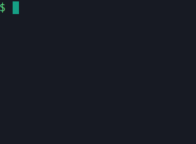

# Scroll

Limits the number of lines written by a program giving an automatic scroll effect.



# Compilation

```sh
g++ -std=c++17 -O3 -DNDEBUG -s scroll.cpp -o scroll
```
<!-- g++ -std=c++17 -O3 -DNDEBUG -s -fuse-ld=lld scroll.cpp -o scroll -->
